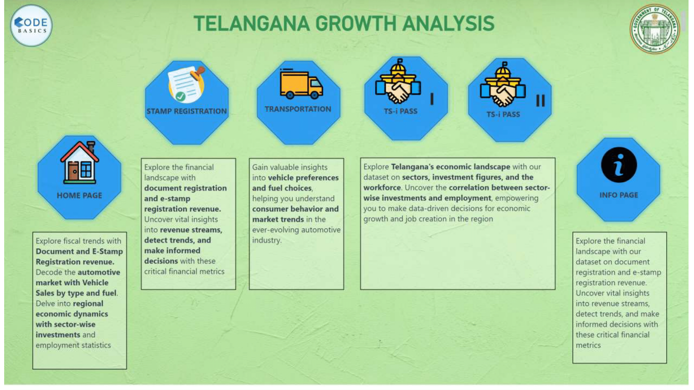
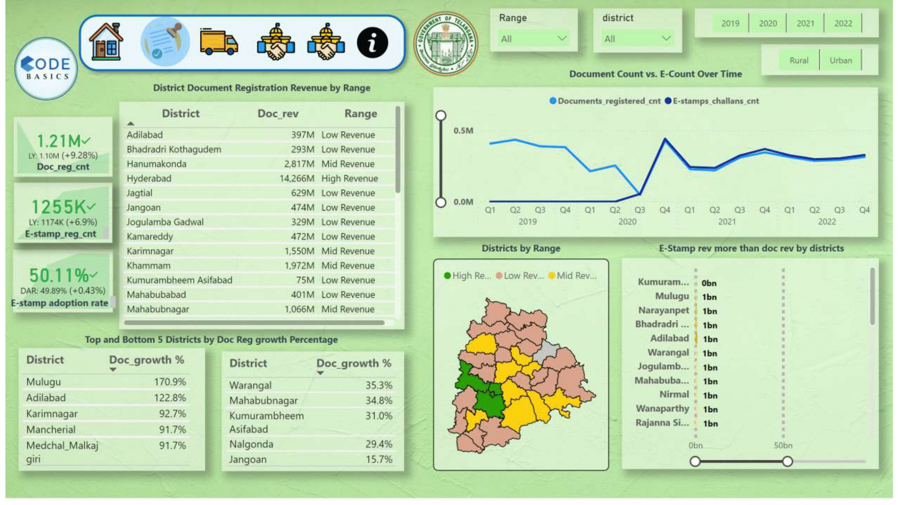
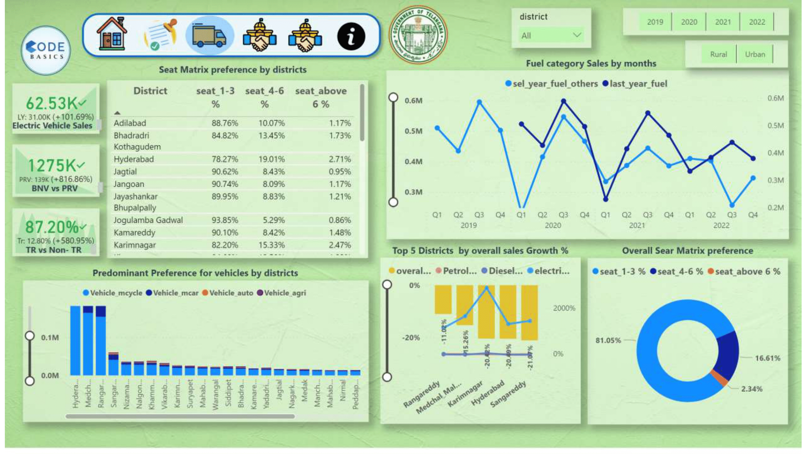
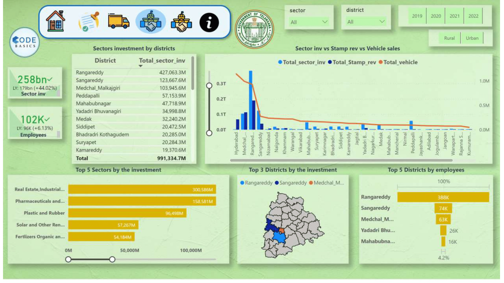
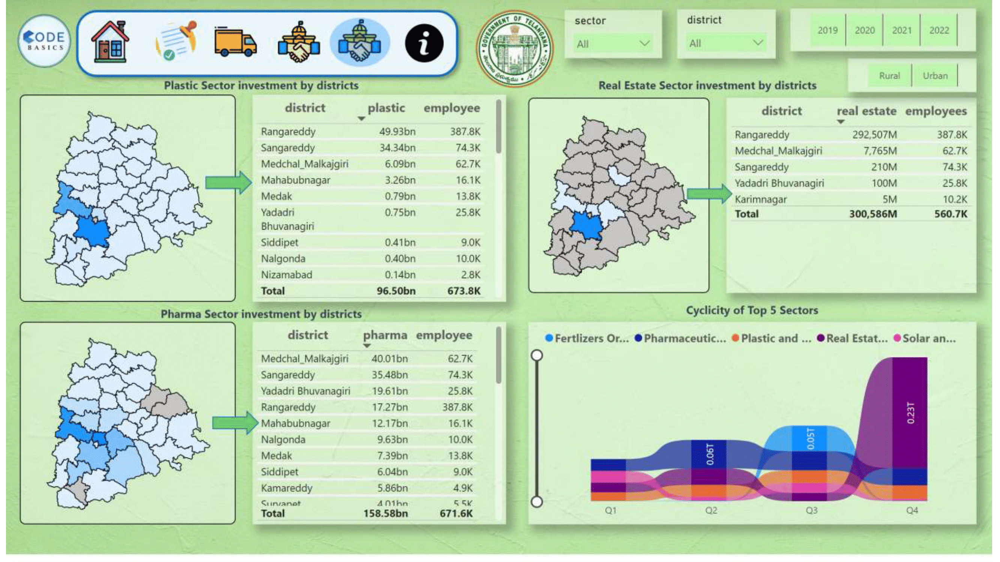
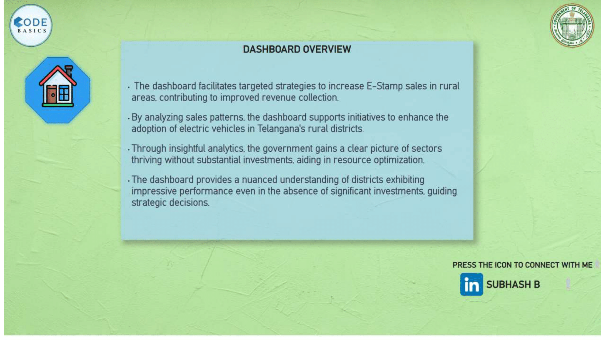

# Telangana Growth Analysis Power BI Dashboard

Welcome to the Telangana Growth Analysis Power BI Dashboard repository! This dashboard provides a comprehensive analysis of key growth indicators for Telangana. It includes insights into stamp registration revenue, transportation trends, and the TS-iPASS initiative.

## Dashboard Sections:

1. ### [Home Page]
   
   - Quick access to other specific views.

2. ### [Stamp Registration View]
   
   - Analysis of document registration revenue and e-stamp registration revenue.
   - Year-wise comparison for informed decision-making.

3. ### Transportation View
   
   - Distribution of vehicles by type and fuel across districts.
   - Insights into vehicle sales growth and preferences.

4. ### TS-iPASS View-I
    
   - Overview of sector-wise investments and employee data.
   - Understand the correlation between investments, vehicle sales, and stamp revenue.

5. ### TS-iPASS View-II
   
   - Overview of district-wise employeement data
   - Understand the correlation between investments, vehicle sales, and stamp revenue.

6. ### Info-page
   
   - Overview of Dashboard

## Data Model:
.png)
- Utilizes a robust data model for efficient data analysis.
- Integrated data from diverse sources for a holistic perspective.

## How to Use:

1. Download and open the Telangana Growth Analysis.pbix file in Power BI Desktop.
2. Navigate through different pages for specific insights.
3. Leverage the interactive features to customize the analysis.

Feel free to explore, analyze, and contribute to enhance the dashboard!

## Contributing:

If you have suggestions, improvements, or additional features to propose, please fork the repository and submit a pull request.

## License:

This project is licensed under the [MIT License](LICENSE).

Happy analyzing!
